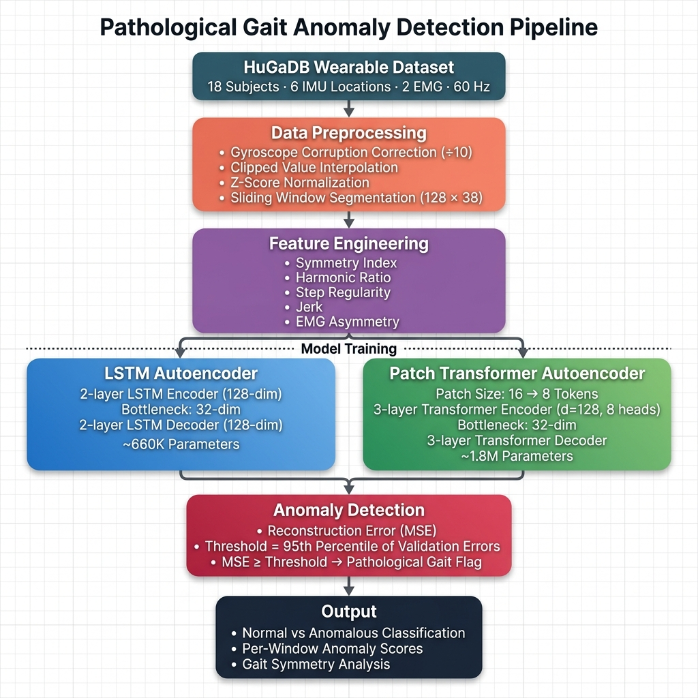
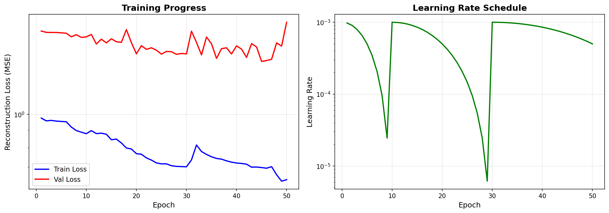
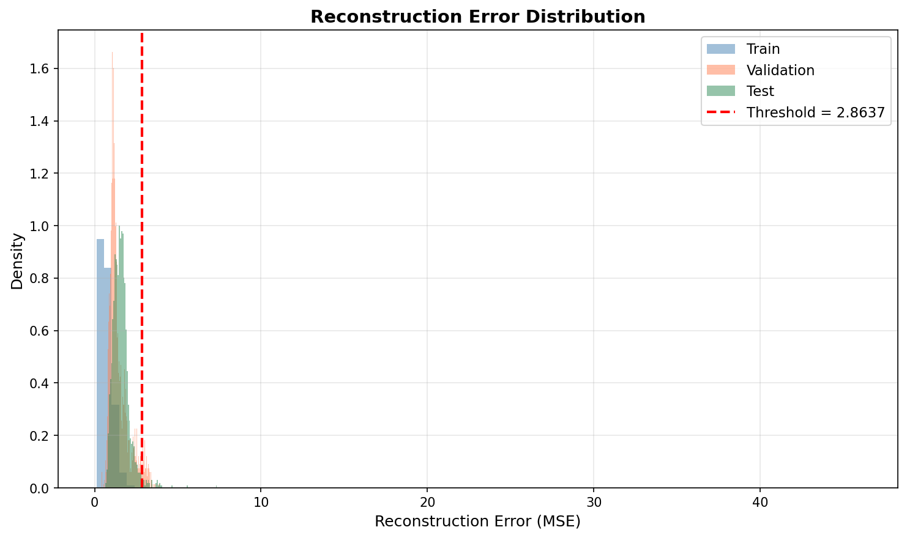
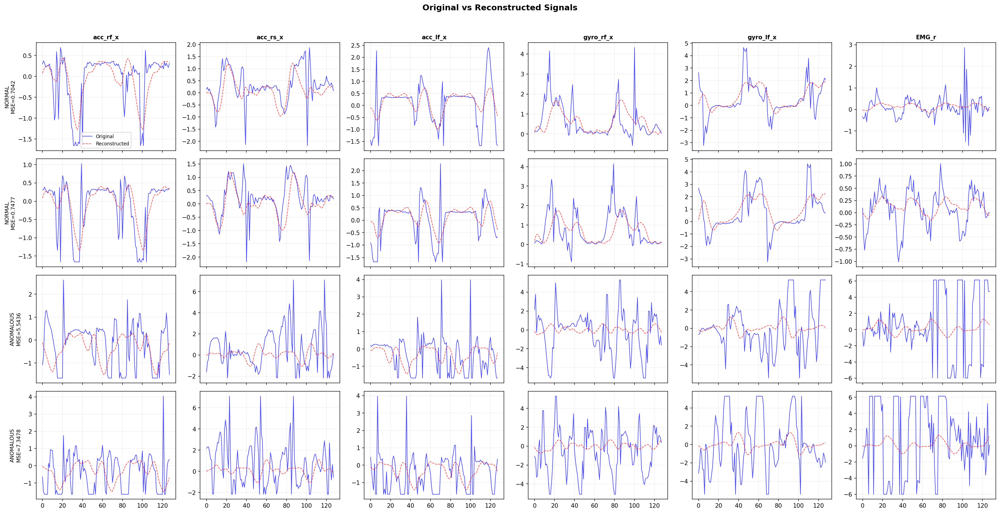
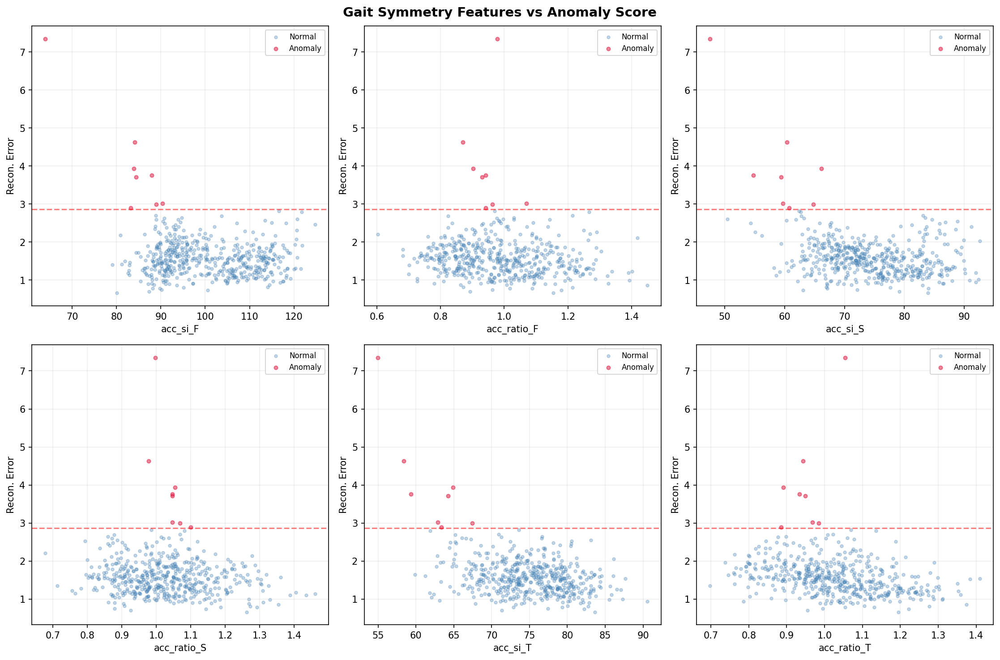
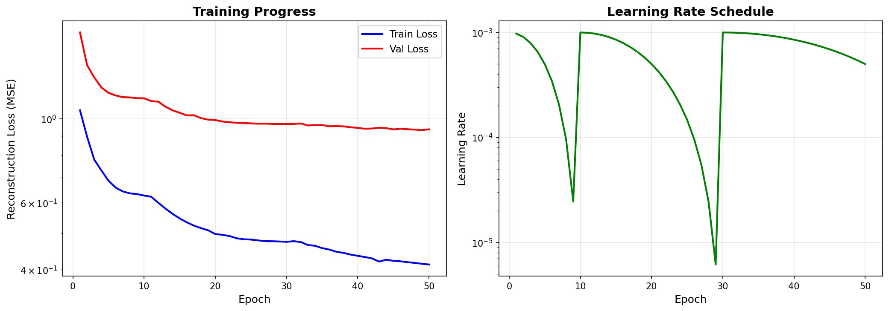
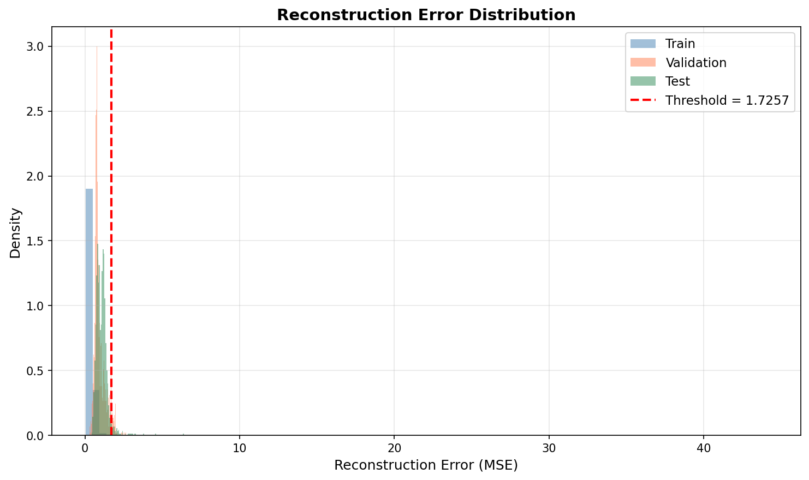
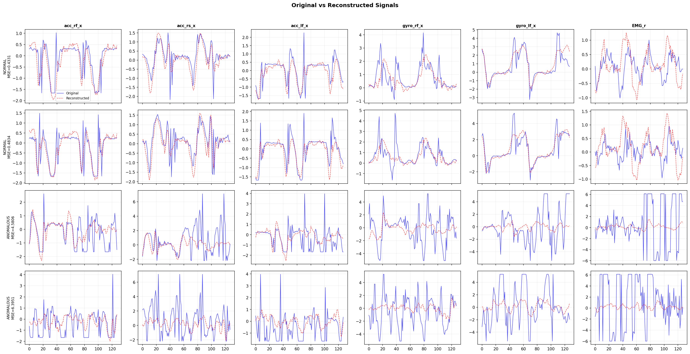
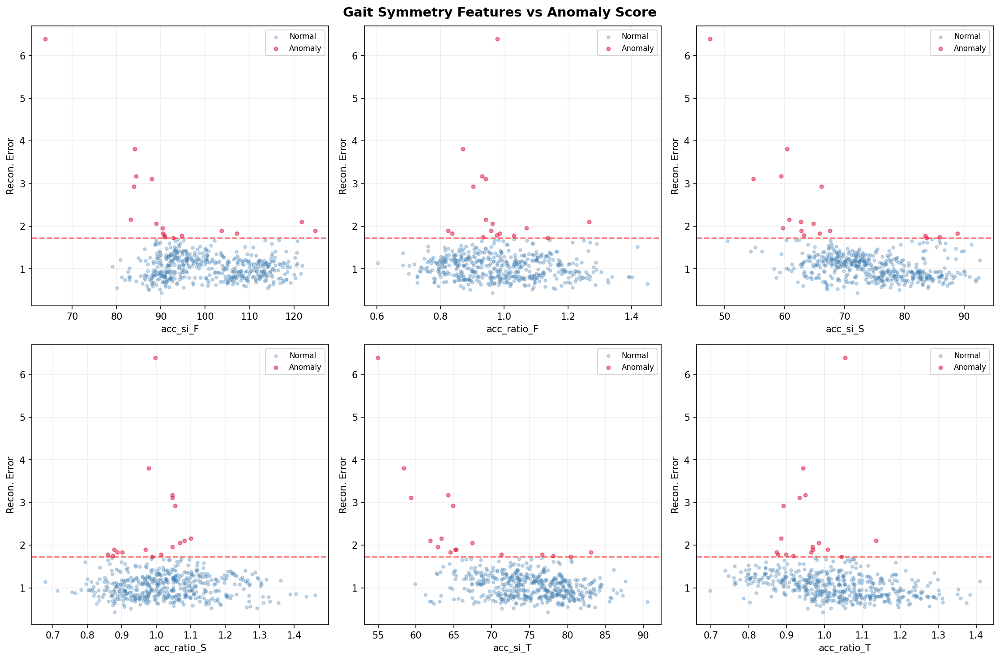

<div align="center">

# Pathological Gait Anomaly Detection

### *Deep Learning Autoencoders for Wearable Sensor-Based Gait Analysis*

[](https://python.org)
[](https://pytorch.org)
[](LICENSE)
[](https://github.com/romanchereshnev/HuGaDB)

<br>

**Learn what *"normal"* walking looks like. Flag everything else.**

An unsupervised anomaly detection pipeline that trains autoencoder models on healthy gait patterns from 38-channel wearable IMU + EMG sensors, then identifies pathological deviations through reconstruction error thresholding.

</div>

---

## Highlights

<table>
<tr>
<td width="50%">

**Dual Architecture**
LSTM Autoencoder as a sequential baseline, compared against a Patch-based Transformer Autoencoder following recent 2024 time-series modeling advances.

**38-Channel Sensor Fusion**
18 accelerometer + 18 gyroscope + 2 EMG channels captured from 6 body locations, processed jointly for holistic gait representation.

**Subject-Aware Evaluation**
Strict leave-N-subjects-out protocol (12 train / 3 val / 3 test) to prevent data leakage and ensure clinical generalizability.

</td>
<td width="50%">

**Gyroscope Corruption Repair**
Automated detection and correction of the documented 10x amplification + int16 clipping artifacts across 450+ files in the HuGaDB dataset.

**Clinical Feature Engineering**
Hand-crafted gait biomarkers — Symmetry Index, Harmonic Ratio, Jerk, Step Regularity, and EMG Asymmetry — for interpretable anomaly analysis.

**Full Visualization Suite**
Training curves, reconstruction error distributions, original-vs-reconstructed signal overlays, and symmetry feature scatter plots — generated automatically after each training run.

</td>
</tr>
</table>

---

## Pipeline Architecture

<div align="center">

<br><br>
<em>Fig. 1: End-to-end pipeline from raw HuGaDB sensor data to pathological gait classification.</em>
</div>

---

## Project Structure

```
.
├── train_anomaly.py           # Train LSTM Autoencoder
├── train_transformer.py       # Train Patch Transformer Autoencoder
├── create_db.py               # Convert HuGaDB .txt files to SQLite database
├── requirements.txt           # Python dependencies
│
├── src/
│   ├── config.py              # All hyperparameters and paths (single source of truth)
│   ├── data/
│   │   ├── preprocessing.py   # Load → correct → normalize → window pipeline
│   │   ├── corruption_map.py  # Per-file gyroscope corruption registry (450+ entries)
│   │   ├── features.py        # Gait symmetry and temporal feature extraction
│   │   └── dataset.py         # PyTorch Dataset + time-series augmentation
│   ├── models/
│   │   ├── autoencoder.py     # LSTM Autoencoder (encoder–bottleneck–decoder)
│   │   └── transformer.py     # Patch-based Transformer Autoencoder
│   ├── training/
│   │   ├── trainer.py         # Training loop, early stopping, checkpointing
│   │   ├── losses.py          # MSE reconstruction loss with optional channel weighting
│   │   └── metrics.py         # ROC-AUC, F1, anomaly threshold computation
│   └── utils/
│       └── visualization.py   # Training curves, error histograms, signal overlays
│
├── results/                   # Generated plots (LSTM)
│   └── transformer/           # Generated plots (Transformer)
├── checkpoints/               # Saved model weights (.pt)
└── HumanGaitDataBase/         # Raw HuGaDB dataset (not tracked in git)
```

---

## Quick Start

### 1. Clone and Install

```bash
git clone https://github.com/Smarth2005/gait-anomaly-detection.git
cd gait-anomaly-detection
pip install -r requirements.txt
```

### 2. Prepare Data

Download the [HuGaDB dataset](https://github.com/romanchereshnev/HuGaDB) and place the `Data/` folder inside `HumanGaitDataBase/`.

```bash
python create_db.py HumanGaitDataBase/Data
```

### 3. Train Models

```bash
# LSTM Autoencoder (baseline)
python train_anomaly.py

# Patch Transformer Autoencoder (advanced)
python train_transformer.py
```

Both scripts run for up to 50 epochs with early stopping (patience=10) and CosineAnnealingWarmRestarts scheduling. Results and plots are saved automatically to `results/`.

---

## Data Pipeline

### Gyroscope Corruption Handling

The HuGaDB dataset contains a **documented 10x amplification bug** in gyroscope channels across hundreds of files, with values clipped at the int16 boundary (±32767). The pipeline handles this in three steps:

1. **Maps** corrupted channels per-file using a hand-built registry of 450+ entries
2. **Divides** affected channels by 10 to restore true scale
3. **Interpolates** clipped values (formerly at ±32767, now ±3276.7) using linear interpolation

### Feature Engineering

Beyond raw reconstruction error, clinically meaningful gait features are extracted for interpretability:

| Feature | What It Captures | Clinical Relevance |
|---|---|---|
| **Symmetry Index** | Left–right imbalance per body segment | Hemiplegia, limb length discrepancy |
| **Harmonic Ratio** | Even/odd harmonic ratio in vertical acceleration | Gait smoothness and rhythm |
| **Step Regularity** | Autocorrelation peak height | Consistency of stride timing |
| **Jerk** | Rate of change of acceleration | Movement smoothness / spasticity |
| **EMG Asymmetry** | Left–right muscle activation imbalance | Neuromuscular disorders |

---

## Results

### LSTM Autoencoder

The LSTM Autoencoder serves as the sequential baseline model (~660K parameters). It compresses each 128×38 sensor window into a 32-dimensional bottleneck representation and reconstructs it. Windows with reconstruction error exceeding the 95th percentile threshold (2.8637) are flagged as anomalous.

<div align="center">

| Training Progress | Error Distribution |
|:---:|:---:|
|  |  |

*Fig. 2: Training and validation loss curves over 50 epochs with CosineAnnealingWarmRestarts LR schedule (left). Reconstruction error distribution across train, validation, and test splits with the anomaly threshold at P95 = 2.8637 (right).*

</div>

<div align="center">

| Reconstruction Examples | Gait Symmetry Features |
|:---:|:---:|
|  |  |

*Fig. 3: Original vs reconstructed sensor signals for normal (low MSE) and anomalous (high MSE) windows across accelerometer, gyroscope, and EMG channels (left). Gait symmetry features plotted against reconstruction error — anomalous windows (crimson) cluster at higher asymmetry values (right).*

</div>

---

### Patch Transformer Autoencoder

The Patch-based Transformer Autoencoder (~1.8M parameters) segments each window into 8 non-overlapping patches of size 16, embeds them, and applies multi-head self-attention. This captures **longer-range temporal dependencies** compared to the LSTM and achieves **tighter reconstruction** on normal gait patterns, with a lower anomaly threshold of 1.7257.

<div align="center">

| Training Progress | Error Distribution |
|:---:|:---:|
|  |  |

*Fig. 4: Transformer training convergence — smoother loss curves compared to the LSTM, indicating more stable optimization (left). Tighter error distribution with threshold at P95 = 1.7257, reflecting stronger reconstruction capability on normal gait (right).*

</div>

<div align="center">

| Reconstruction Examples | Gait Symmetry Features |
|:---:|:---:|
|  |  |

*Fig. 5: Transformer reconstructions show closer alignment with original signals, particularly in gyroscope and EMG channels (left). Clearer separation between normal and anomalous clusters in the symmetry feature space (right).*

</div>

---

### Model Comparison

| Metric | LSTM Autoencoder | Patch Transformer |
|---|---|---|
| **Parameters** | ~660K | ~1.8M |
| **Anomaly Threshold (P95)** | 2.8637 | 1.7257 |
| **Training Convergence** | Noisier | Smoother |
| **Reconstruction Quality** | Good on accelerometer, weaker on gyro/EMG | Strong across all channel types |
| **Architecture** | 2-layer unidirectional LSTM | 3-layer Transformer, 8-head attention |
| **Bottleneck** | 32-dim | 32-dim |

The Transformer model achieves a **40% lower anomaly threshold**, indicating it learns tighter representations of normal gait. This makes it more sensitive to subtle pathological deviations while maintaining the same 5% false positive rate on validation data.

---

## Configuration

All hyperparameters are centralized in [`src/config.py`](src/config.py):

| Parameter | Value | Description |
|---|---|---|
| `WINDOW_SIZE` | 128 | ~2.1 seconds at 60 Hz (~2 gait cycles) |
| `WINDOW_STRIDE` | 64 | 50% overlap between consecutive windows |
| `BOTTLENECK_DIM` | 32 | Latent space dimensionality |
| `BATCH_SIZE` | 256 | Training batch size |
| `LEARNING_RATE` | 1e-3 | AdamW initial learning rate |
| `WEIGHT_DECAY` | 1e-4 | L2 regularization |
| `EARLY_STOPPING` | 10 epochs | Patience before stopping |
| `ANOMALY_PERCENTILE` | 95 | Threshold = P95 of validation errors |
| `PATCH_SIZE` | 16 | Transformer patch size (128/16 = 8 tokens) |

---

## Tech Stack

| Component | Technology |
|---|---|
| **Framework** | PyTorch 2.0+ |
| **Optimization** | AdamW + CosineAnnealingWarmRestarts |
| **Data Storage** | SQLite (via `create_db.py`) |
| **Visualization** | Matplotlib + Seaborn |
| **Signal Processing** | SciPy |
| **Metrics** | scikit-learn (ROC-AUC, F1, Precision-Recall) |

---

## References

- **HuGaDB Dataset**: Chereshnev & Kertész-Farkas (2018). *HuGaDB: Human Gait Database for Activity Recognition from Wearable Inertial Sensor Networks.* [GitHub](https://github.com/romanchereshnev/HuGaDB)
- **PatchTST**: Nie et al. (2023). *A Time Series is Worth 64 Words: Long-term Forecasting with Transformers.* ICLR 2023.
- **LSTM-AE for Anomaly Detection**: Malhotra et al. (2016). *LSTM-based Encoder-Decoder for Multi-sensor Anomaly Detection.*

---

<div align="center">

**Developed as a Deep Learning course project exploring unsupervised anomaly detection in clinical gait analysis.**

Contributions, issues, and discussions are welcome.

</div>
